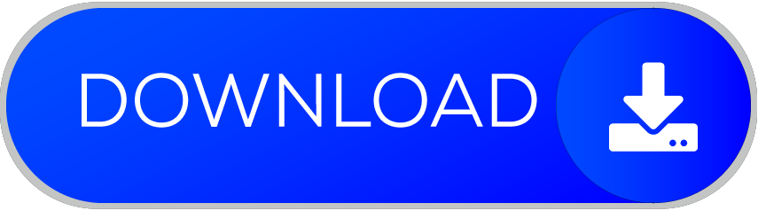

<link rel="stylesheet" type="text/css" href="/style.css">

<h1 align="center">👋 Hello, I'm Adarsh Jena!</h1>

  <a href="https://adarshjena.in">Website</a> •
  <a href="https://www.linkedin.com/in/adarshnjena/">LinkedIn</a> •
  <a href="https://twitter.com/AdarshNJena">Twitter</a>

I'm a passionate Programmer with a keen interest in Web Technologies. I love building Real World projects and exploring new tools and technologies. Constantly learning and growing in the world of software development is what excites me the most.

  Download Resume -->

<a href="https://adarshjena.in/pdf/Profile.pdf" target="_blank" download>
  <button>
</button>
</a>

## 🚀 Skills and Tools

- Programming Languages: JavaScript , CPP , Drat
- Web Development: React , Next.js
- Databases: Django , MongoDB , Supabase , Firebase
- Version Control: Git, GitHub

 
 

## 💼 Experience
- I am currently a student and have a multiple freelance experience 

## 🌱 Currently Learning
- Building Progressive Web App
- WebAssembly

### 📫 How to reach me

- [Email](mailto:adarshnjena@gmail.com)
- [Website](https://adarshjena.in)
- [LinkedIn](https://www.linkedin.com/in/adarshnjena/)
- [Twitter](https://twitter.com/AdarshNJena)

 
  
 
  
 

### 🌐 Check out my portfolio

Visit my [portfolio website](https://adarshjena.in) to see my work and projects.

<!-- 

 -->

<!-- 
 -->
