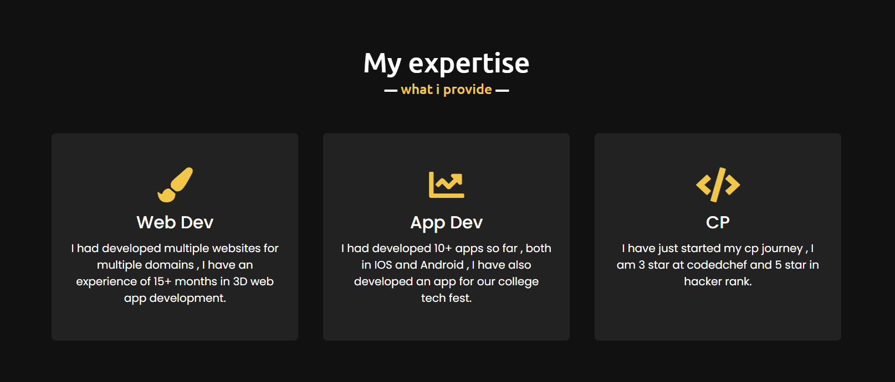

<h1 align="center">👋 Hello, I'm Adarsh Jena!</h1>

  <a href="https://adarshjena.in">Website</a> •
  <a href="https://www.linkedin.com/in/adarshnjena/">LinkedIn</a> •
  <a href="[Your Twitter URL]">Twitter</a>

<!-- Add a short introduction about yourself -->
I'm a passionate Programmer with a keen interest in Web Technologies. I love building Real World projects and exploring new tools and technologies. Constantly learning and growing in the world of software development is what excites me the most.

<!-- Add a catchy banner or an image showcasing your work or interests -->

## 🚀 Skills and Tools

<!-- List the technologies, tools, and programming languages you're experienced with -->
- Programming Languages: JavaScript , CPP , Drat
- Web Development: React , Next.js
- Databases: Django , MongoDB , Supabase , Firebase
- Version Control: Git, GitHub

## 💼 Experience

<!-- Add your work experience, internships, or notable projects -->
- I am currently a student and have a multiple freelance experience 

## 🌱 Currently Learning

<!-- Mention the technologies or concepts you're currently learning -->
- Building Progressive Web App
- 

## 📫 How to Reach Me

<!-- Add your contact information such as email address -->
- 📧 adarshnjena@gmail.com

<!-- Add badges for your GitHub stats, top programming languages, etc. -->

<!-- Add a footer with credits or acknowledgments if needed -->
### 📫 How to reach me

<!-- Add your contact information or social media links -->
- [Email](mailto:adarshnjena@gmail.com)
- [Website](https://adarshjena.in)
- [LinkedIn](https://www.linkedin.com/in/adarshnjena/)
- [Twitter](https://twitter.com/yourusername)

### 🌐 Check out my portfolio

<!-- Add a link to your portfolio or showcase projects -->
Visit my [portfolio website](https://adarshjena.in) to see my work and projects.

<!-- Add any additional sections or customize the content based on your preferences -->

<!-- Add a footer with relevant badges or acknowledgments -->
<!-- For example: -->
<!-- 
 -->
